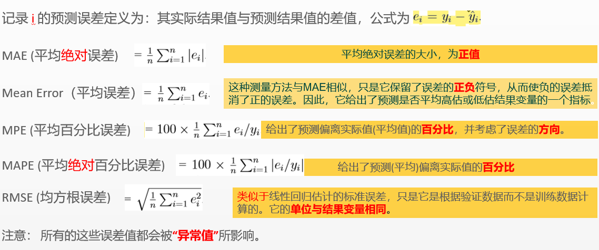

机器学习评估预测性能
~~~~~~~~~~~~~~~~~~~~~

 首先，机器学习预测模型的准确性并不等同于拟合优度。
 经典的性能统计度量的目的是找到一个模型，它能很好地适应模型所训练的数据。在这里我们感兴趣的是，应用新记录时的有高准确率的模型。

预测精度测量
=====================

                                一些流行的预测精度数值测量

 ============================= ======================================================================================
     简写                           描述
 ============================= ======================================================================================
      ME Mean Error             Mean Error 平均误差，可能有正负值
      MAE                       Mean Absolute Error/deviation 平均绝对误差/偏差 与ME相似，但为误差的绝对值，为正值
      MPE                       Mean Percentage Error 平均百分比误差
      MAPE                      Mean Absolute Percentage error 平均绝对百分比误差
      RMSE                      Root Mean Squared error 均方根误差
 ============================= ======================================================================================

 如下为各个指标的计算公式：

 
.. code:: r

 # 根据选择的6特征变量的模型来预测验证，检查模型预测的准确性
 car.lm.step.pred <- predict(car.lm.step.both, valid.df1k)
 > accuracy(car.lm.step.pred, valid.df1k$Price)
               ME     RMSE      MAE        MPE     MAPE
 Test set 59.26886 1334.978 1024.979 -0.4212544 9.357492 

查准率、查全率与F1
======================

 错误率和精度虽常用，但并不能满足所有任务需求，比如检索出的信息是用户感兴趣的信息，需要用其他性能度量。“查准率Precision”与“查全率Recall”更为适用此类需求的性能度量。以二分类为例，语句分类结果混淆矩阵如下：

=========== ======================== ========================
 真实情况      预测结果 - 正例          预测结果 - 反例
=========== ======================== ========================
   正例          TP (真正例)           FN (假反例)
   反例          FP (假正例)           TN (真反例)
=========== ======================== ========================

 查准率与查全率的计算公式为： 

   1. 查准率（准确率） P = TP / (TP + FP)
 
   2. 查全率（召回率） R = TP / (TP + FN)

 查准率与查全率是一对矛盾的度量。以横轴为查全率，纵轴为查准率作图“P-R曲线”，在进行模型性能比较时，若一个学习器的P-R曲线被另一个学习器曲线完全“包住”，可以断定后者性能优于前者。
 度量F1是基于查准率与查全率的调和平均，公式为： F1 = 2 * P * R / (P + R) 
 与算术平均(P + R)/2 与几何平均sqrt(P*R)相比，调和平均更重视较小值。

 说明：
   a. 此处隐式假设了错误的均等代价

   b. 非均等代价顾名思义

ROC与AUC
===================

 ROC全称是“受试者工作特征”（Receiver Operating Characteristic）曲线，ROC曲线纵轴是“真正例率True Positive Rate:TPR”，横轴是“假正例率False Positive Rate:FPR”，两者分别定义为：
 TPR = TP/(TP + FN)
 FPR = FP/(TN + FP)
 与P-R图相似，若一个学习器的ROC曲线被另一个学习器的曲线完全“包住”，则可断言后者性能优于前者。若两个曲线产生交叉，一定要进行比较，则比较合适的判据是比较ROC曲线下的面积，即AUC(Area Under ROC Curve)

代价敏感错误率与代价曲线
===========================
 
 结合现实任务如错误的把健康病人归类为患者或者把患者归类为健康人，会造成严重的安全事故，为权衡不同类型错误所造成的不同损失，可为错误赋予“非均等代价 unequal cost”，在非均等代价下，ROC曲线不能直接反映出学习器的期望总体代价，代价曲线（Cost Curve）可以达到目的，代价曲线的横轴为取值[0,1]的正例概率代价，纵轴是取值为[0,1]的归一化代价。

比较检验
===========

 机器学习中性能比较非常负责，涉及到如下几个重要的因素：

     1. 希望比较的是模型的泛化性能，而这里比较的是验证集/测试集的性能，对比结果未必相同
 
     2. 测试集性能与测试集本身选择有很大关系
 
     3. 很多机器学习算法本身具备一定的随机性

  基于如上，使用如下适当的方法对学习器、模型性能进行比较：
 
     1. 假设检验

     2. 交叉验证t检验

     3. McNemar 检验

     4. Friedman检验与Nemenyi后续检验

     5. 偏差与方差
