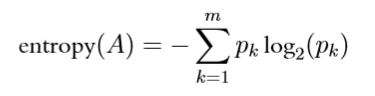
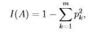
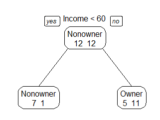

样例- 分类树、回归树
~~~~~~~~~~~~~~~~~~~~~
 
  在数据驱动的决策中，树最透明、最容易解释。分类树用于分类，回归树用于数值预测。分类树的两个核心思想是变量空间递归划分recursive partitioning的思想与使用验证集进行剪枝pruning，限制树最大深度的的思想。
  算法学习目的是为了产生一棵泛化能力强，即处理未见示例能力强，基本流程遵循简单而直观的“分而治之”的策略。学习的关键是如何选择最优划分属性，希望树的分支节点所包含的样本尽可能属于同一类别。

- 分类树（Classification Trees）
  
  分类树算法希望树的分支节点所包含的样本尽可能属于同一类别，即节点的纯度Purity越来越高。在这里，每一片叶子都代表一个类别。如何选择最优划分属性参考如下。

  分类树最优划分指标：

     1. 信息熵，公式如下：

.

     2. 基尼杂质指数Gini Impurity Index，基尼杂质指数越小，纯度越高，选择那个使得划分后基尼指数最小的属性作为最优划分属性，公式如下：

.

     3. 增益率：不常用

- 回归树（Regression Trees）

  回归树如何选择最优划分属性，一个典型的杂质测量是离末端节点偏差的平方和，等于误差的平方和。在这里，每一片叶子表示的是一个预测值，取值是连续的。

  TREE算法优缺点如下：

 ============================== ======================================================================================
        优点                                                  缺点
 ============================== ======================================================================================
  不需要转换变量                        对数据的变化敏感，细微的变化也会导致不同的分裂 
  变量子集选择是自动化的                非线性和非参数化
  对缺失值异常值的鲁棒性非常强          需要大量的数据集才能构造一个好的分类器
  泛化错误率不超贝叶斯2倍               由于多次排序、剪枝导致计算资源消耗多
 ============================== ======================================================================================

- 模型性能提升

    1. 随机森林Random Forests算法
           随机森林测量不同预测因子的相关贡献，用于对“变量重要性”评分。

    2. Boosted Trees 提升树算法
           提升树支持回归跟分类。

    3. 注意：Random Forests与Boosted Trees的使用效果较好，但是会导致模型的可解释性大大降低

- 分类树代码样例

.. code:: r 

 # 使用RidingMovers割草机的数据集
 # 1. 计算信息熵与基尼杂质指数
 > mower.df <- read.csv("D:\\Books\\RidingMowers.csv")
 > head(mower.df)
   Income Lot_Size Ownership
 1   60.0     18.4     Owner
 2   85.5     16.8     Owner
 3   64.8     21.6     Owner
 4   61.5     20.8     Owner
 5   87.0     23.6     Owner
 6  110.1     19.2     Owner
 > dim(mower.df)
 [1] 24  3
 > 
 > library(rpart)
 > library(rpart.plot)
 Error in library(rpart.plot) : 不存在叫‘rpart.plot’这个名字的程辑包
 # 下载rpart.plot.zip文件，手工安装
 # 执行rpart()运行分类树，
 # 定义rpart.control决定树的深度
 > calss.tree <- rpart(Ownership ~ ., data = mower.df, control = rpart.control(maxdepth = 2), method = "class")
 # prp画出树，color,shape, information都可以显示
 > prp(class.tree3, type = 1, extra = 1, split.font = 1 , varlen = 10)
 

.. code:: r

 >
