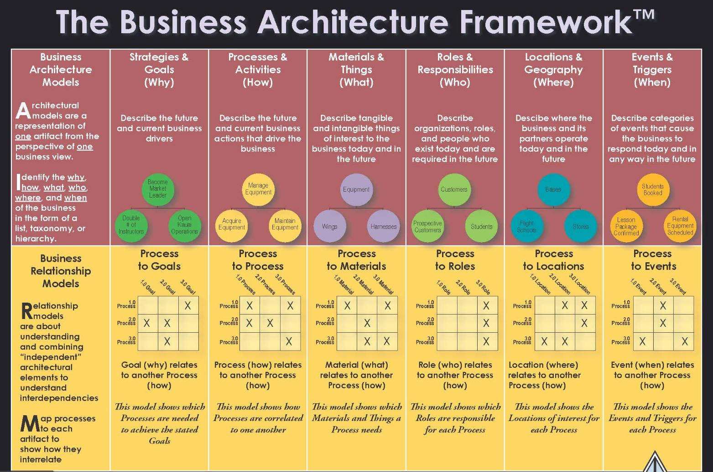

100+管理模型
--------------

- 1. Business Architecture Framework 业务架构框架

  展示业务架构模型与业务关系模型：

- 2. 成本、收益与利润模型

     2.1 成本数量模型

     2.2 收入数量模型

     2.3 利润数量模型

     2.4 盈亏平衡分析

- 3. 管理科学技术

     3.1 线性规划 Linear programming

         适用于：函数表达式是线性的，约束条件也是线性的，目标函数要求实现最大值和最小值，在市场营销、财务和运营管理领域有广泛应用
     
     3.2 整数线性规划Integer Linear Programming

         适用于：部分或全部的决策变量的解是整数

     3.3 网络模型 Network Model
 
         网络是问题的一种图形描述，这些图形由一些圆圈（节点）以及连线（弧）表示
         适用于：解决运输系统设计、信息系统设计、项目时间表设计
         
     3.4 项目计划 Project Scheduling: PERT/CRM

     3.5 库存模型 Inventory Model

         适用于：解决库存的双重问题，维持足够的库存量保证满足产品需求的同时，必须尽量降低库存以压缩开支

     3.6 等候线或排队模型 Waiting Line or Queueing Model

         适用于：帮助管理者理解排队系统，做出最优决策

     3.7 动态规划 Dynamic Programming

         大问题分解为小问题并解决，最终就得到了大问题的最优解
